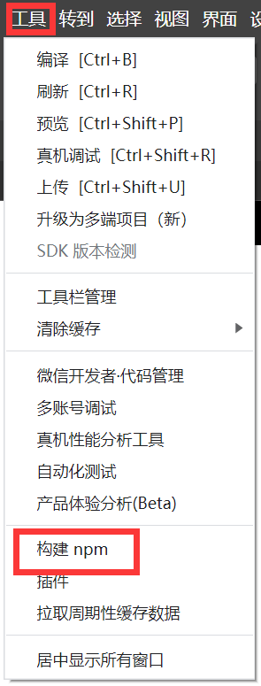

项目为碳烤小肥肠的开源项目二次开发
https://blog.csdn.net/qq_64203396/article/details/139029486

使用微信小程序和TDesign组件实现一个简易的问卷调查小程序。使用微信小程序的本地存储能力（[storage](https://developers.weixin.qq.com/miniprogram/dev/api/storage/wx.setStorage.html)）来保存用户的问卷以及答案，如需接入后端，可自行添加。

# 使用与安装

1. 下载代码`git clone https://github.com/A-walking-star/questionnaire-miniprogram.git`

2. 使用微信开发者工具打开该项目

   

3. 在终端执行`npm i tdesign-miniprogram`

   

   

4. 在微信开发者工具中引入工程，构建npm

   

   

# 常见问题

## [渲染层错误] Uncaught TypeError: Cannot read property 'clientHeight' of null

### 解决方案

**修改任意调试基础库版本。**

随便改一个最新的调试基础库版本即可恢复正常。

**声明：本项目不可用于商业。**